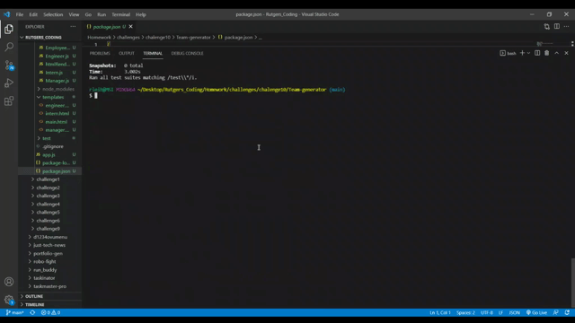

# Team Generator

A command line app which uses cards to create a team profile, running in node.js

## Installation

1. download the repository
2. Run npm init -y
3. Run npm install
4. This is for Node.js.

## Usage

1. Run node app.js into the command-line/terminal. 
2. Follow along with prompts to select employees
3. Answer prompts to fill out information for Manager, Engineer(s), and Intern(s).

## Screenshot and Video

## Contributors

Greg D'amato
